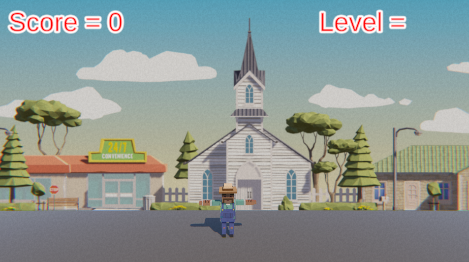

# Run and Jump Prototype 🎮✨

## Overview 🕹️

This is a fast-paced side-scrolling game where the player controls a character that jumps over oncoming obstacles to avoid crashing. 🚶‍♂️💨 The game includes dynamic background scrolling, animations, sound effects, and particle effects to enhance the gaming experience. 🎶💥

  <!-- Replace with your actual cover image link -->

---

## Features 🎯

- **Jumping Mechanic**: The player can make the character jump over obstacles using the spacebar. ⬆️
- **Endless Background**: The background loops seamlessly to give the illusion of continuous movement. 🌍
- **Animations**: The character has running, jumping, and death animations. 🏃‍♂️💀
- **Obstacles**: Timed obstacles spawn in front of the player, challenging their reflexes. 🧱
- **Sound Effects & Music**: Sounds for actions like jumping, crashing, and running, along with background music. 🎧🎶
- **Particle Effects**: Explosions and splatters that trigger when obstacles are hit or when the player dies. 💥💫

---

## Play the Game 🎮

You can play the game by visiting the following link:

[Run and Jump Prototype](https://eddieborbon.github.io/25-5-clock/](https://play.unity.com/en/games/04452778-8b76-4393-9888-7df3c7828ae5/infinity-runner) <!-- Replace with your actual game URL -->

---

## Game Mechanics 🎮

1. **Player Movement**: The player can jump over obstacles using the spacebar. 🦘
2. **Collisions**: The game halts when the player collides with an obstacle, ending the game. 💥
3. **Endless Scrolling**: The background repeats itself seamlessly to simulate movement. 🌄
4. **Obstacles**: Obstacles spawn at timed intervals and need to be avoided or destroyed. 🧱

---

## Technologies Used 🛠️

- **Unity**: Game engine used for development. 🎮
- **C#**: Programming language used to implement game logic. 💻
- **Sound Design**: Integrated sound effects for movement and collisions. 🎶
- **Particle Effects**: Added visual effects for explosions and impacts. 💥

---

## Challenge & Quiz 📝

### Balloons & Booleans 🎈
Apply your knowledge of physics, scrolling backgrounds, and special effects in this mini-challenge. Troubleshoot various issues as you control a balloon collecting tokens and avoiding obstacles. 🎯

---

## Installation 🖥️

1. Clone the repository or download the project files.
2. Open the project in **Unity**.
3. Play the game by pressing the "Play" button in the Unity editor.
4. Customize assets or mechanics to make your own version of the game! 🎮

---

## Future Improvements 🚀

- **Multiplayer Mode**: Add a second player or co-op mode. 🤝
- **Difficulty Levels**: Adjust the speed or frequency of obstacles to challenge players further. ⚡
- **Power-ups**: Introduce power-ups like shields or speed boosts. 💨

---

🎮 **Enjoy the game, and may the best jumper win!** 🏆
